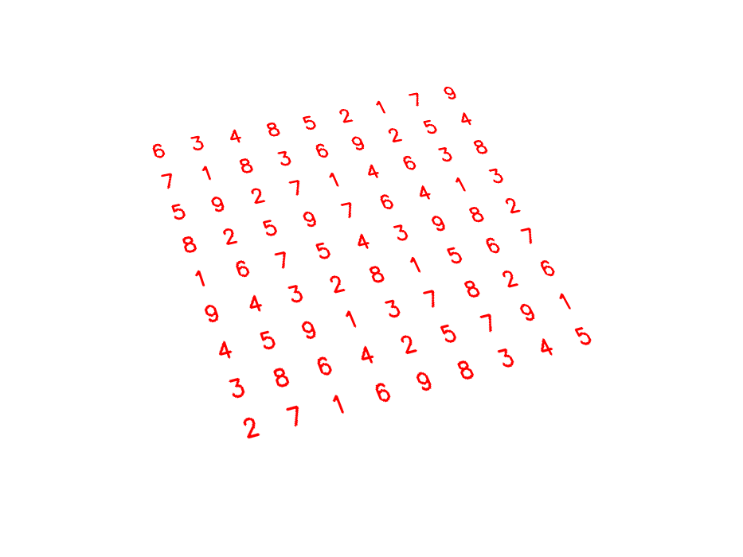

# sudokuCV

[](https://travis-ci.org/torjeikenes/sudokuCV)

Sudoku solver using OpenCV.

## Prerequisits

* Tesseract
```
sudo apt-get install tesseract-ocr
```

## Installation 

```
git clone https://github.com/torjeikenes/sudokuCV
cd sudokuCV
pip install -r requirements.txt
```

## Usage
```
python3 sudoku/main.py -i <Image File>
```


## Procedure 

### Detection

* Input image

* Treshold image to find the biggest contour which is the grid

* Find corners of the grid from the biggest contour in the last image
 
* Warp the binary image and the gray image with the points found earlier

* The warped gray image is thresholded for ocr

* Filter out the numbers from the first warped image and repair grid lines to only get the cells

* The cells are sorted and used to cut out the cell from the thresholded image and send it to Tesseract to recognise the number


* The resulting numbers are put in a numpy matrix
```
[[0, 0, 0, 0, 5, 0, 0, 7, 0],
 [0, 0, 0, 3, 0, 0, 2, 5, 0],
 [0, 0, 0, 0, 0, 4, 0, 3, 8],
 [0, 0, 0, 0, 7, 6, 4, 0, 3],
 [1, 0, 0, 0, 0, 0, 0, 0, 2],
 [9, 0, 3, 2, 8, 0, 0, 0, 0],
 [4, 5, 0, 1, 0, 0, 0, 0, 0],
 [0, 8, 6, 0, 0, 5, 0, 0, 0],
 [0, 7, 0, 0, 9, 0, 0, 0, 0]]
```

### Solver

The solver takes a numpy matrix as the input and uses recursive backtracking to solve the sudoku. Inspired after [this computerphile video](https://www.youtube.com/watch?v=G_UYXzGuqvM).

### Display

* Uses the positions of all the cells from the filtered image to display all the numbers on a black background


* Warp inversion of last image onto the original image using the points found under detection


* The image is merged with the original image with bitwise_and


